# Architecture Diagram

## Expense Management System – Azure Architecture

```mermaid
graph TD
    User["👤 User\n(Browser)"]
    AppService["🌐 Azure App Service\napp-appmodassist\n(ASP.NET Razor Pages + REST API)"]
    ManagedIdentity["🔑 User-Assigned\nManaged Identity\nmid-AppModAssist"]
    SQL["🗄️ Azure SQL Database\nsql-appmodassist\nDatabase: Northwind\n(Expense Management Schema)"]
    EntraID["☁️ Microsoft Entra ID\n(Azure Active Directory)"]

    User -->|"HTTPS (port 443)"| AppService
    AppService -->|"Assumes identity"| ManagedIdentity
    ManagedIdentity -->|"Requests access token"| EntraID
    EntraID -->|"Issues JWT access token"| ManagedIdentity
    AppService -->|"Active Directory Managed Identity\n(no password – token auth)"| SQL
```

## Component Details

| Component | Azure Resource | Configuration |
|-----------|---------------|---------------|
| **App Service** | `app-appmodassist` | .NET 8, managed identity assigned, `AZURE_CLIENT_ID` env var set |
| **Managed Identity** | `mid-AppModAssist` | User-assigned, granted `db_datareader`, `db_datawriter`, `EXECUTE` on database |
| **Azure SQL** | `sql-appmodassist / Northwind` | Entra ID authentication enabled, firewall allows Azure services |
| **Entra ID** | Microsoft managed | Issues tokens for managed identity; Entra ID admin set on SQL server |

## Authentication Flow

## Data Flow

## Security Notes

- The application uses **no passwords** – all database access is via managed identity token authentication.
- The managed identity is **user-assigned** so it can be pre-configured before app deployment.
- Connection strings use `Authentication=Active Directory Managed Identity;User Id=<ClientId>` in production.
- Local development uses `Authentication=Active Directory Default` (requires `az login`).
- All database interactions go through **stored procedures only** – no ad-hoc SQL in application code.
